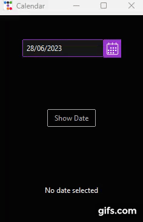

# Simple Calendar

Simple Calendar App using ttkbootstrap

App was made following [this](https://www.youtube.com/watch?v=zCRQvnVO10c&ab_channel=AlinaChudnova) tutorial made by youtuber Alina Chudnova.

### Features

- Select a date from calendar

## Demo

## Requirements
- Python 3+
- ttkbootstrap

## Usage

1. Run 'python main.py'